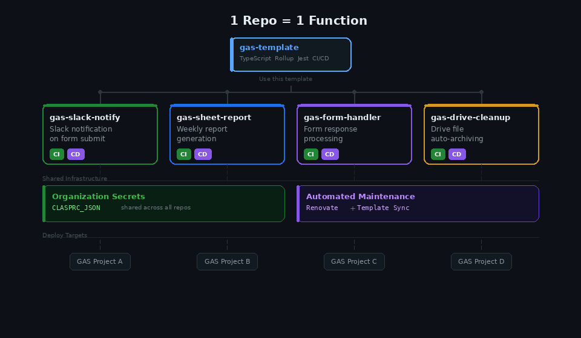

# Apps Script Fleet

[](https://github.com/h13/apps-script-fleet/actions/workflows/ci.yml)
[](https://github.com/h13/apps-script-fleet/blob/main/LICENSE)
[](https://nodejs.org/)
[](https://www.typescriptlang.org/)
[](https://developers.google.com/apps-script)

[English](README.md)

**Google Apps Script を組織全体でスケールさせるためのインフラ。**

既存の GAS テンプレートは「1 つのプロジェクトをモダンに開発する方法」を提供します。Apps Script Fleet はその先にある問題を解決します — このテンプレートからリポジトリを作成して Script ID を設定すれば、CI/CD パイプラインがすでに動いている状態でスタートできます。GitHub でも GitLab でも、クラウドでも Self-Managed でも動作します。

**[→ クイックスタート](#クイックスタート)** · [含まれるもの](#含まれるもの) · [他のテンプレートとの違い](#他のテンプレートとの違い) · [FAQ](#faq)

## 課題

GAS プロジェクトは小さく始まりますが、増殖します。Slack 通知、レポート自動生成、フォーム処理、Drive のファイル整理 — 気づけば組織に十数個のスクリプトが存在しています。それぞれに必要なもの：

- TypeScript の設定
- バンドラ（Rollup, Webpack, Vite）
- リント・フォーマッタ
- テスト環境とカバレッジ設定
- dev / prod の CI/CD ワークフロー
- clasp の認証管理
- 依存関係の継続的な更新

1 プロジェクトあたりのセットアップに 2〜4 時間。10 プロジェクトなら丸 1 週間がボイラープレートに消えます。さらにその後も、10 個の異なる設定を個別にメンテナンスし続けることになります。

## 解決策：1 リポ = 1 機能



Apps Script Fleet は各 GAS 機能を独立したリポジトリとして扱い、組織レベルの共有インフラで支えます：

- **初回のみの設定**: `CLASPRC_JSON` を組織/グループレベルのシークレットに追加（[GitHub](https://docs.github.com/ja/actions/security-for-github-actions/security-guides/using-secrets-in-github-actions#creating-secrets-for-an-organization) または [GitLab](https://docs.gitlab.com/ci/variables/#for-a-group)）。このテンプレートから作成されたすべてのリポが自動的に利用します。
- **プロジェクトごとの設定（約 5 分）**: テンプレートからリポを作成 → Script ID を設定 → 完了。PR/MR で CI が走り、マージで本番デプロイ。
- **一括メンテナンス**: [Renovate](https://docs.renovatebot.com/) が全リポの依存関係を自動更新。[Template Sync](.github/workflows/sync-template.yml) がツーリングの改善を上流テンプレートから自動伝播。

違いを一目で：


## 含まれるもの

| カテゴリ   | ツール                                                 |
| ---------- | ------------------------------------------------------ |
| 言語       | TypeScript（strict モード）                            |
| バンドラ   | Rollup（GAS 互換出力）                                 |
| デプロイ   | clasp（dev / prod 環境）                               |
| テスト     | Jest（カバレッジ閾値 80%）                             |
| リント     | ESLint, Prettier, Stylelint, HTMLHint                  |
| Git フック | husky + lint-staged                                    |
| CI/CD      | GitHub Actions + GitLab CI（PR で CI、マージで CD）    |
| 依存管理   | Renovate（自動更新 + オートマージ）                    |
| 同期       | Template Sync ワークフロー（上流の設定変更を自動反映） |

その結果 — 開発者の1日はこう変わります：


## 他のテンプレートとの違い

|                    | [Apps Script Engine](https://github.com/WildH0g/apps-script-engine-template) | Apps Script Fleet                                |
| ------------------ | ---------------------------------------------------------------------------- | ------------------------------------------------ |
| 設計思想           | 機能豊富な DX                                                                | 最小限の制約                                     |
| 最適な用途         | 単一の複雑なプロジェクト                                                     | 多数の小さな自動化                               |
| フロントエンド開発 | Vite + Alpine.js + Tailwind                                                  | 基本的な HTML（GAS 組み込み）                    |
| テスト             | Vitest（任意）                                                               | Jest（80% カバレッジ必須）                       |
| テンプレート同期   | —                                                                            | 週次（自動 PR）                                  |
| 組織レベルの認証   | —                                                                            | CLASPRC_JSON 共有シークレット（GitHub + GitLab） |

> リッチな UI をクライアントサイドフレームワークで構築する場合は、[Apps Script Engine](https://github.com/WildH0g/apps-script-engine-template) が適しています。
> 組織全体で 5 つ以上の小さな GAS 自動化を管理する場合は、Apps Script Fleet の出番です。

## クイックスタート

- **GitHub / GitHub Enterprise Server**: [docs/setup-github.ja.md](docs/setup-github.ja.md)
- **GitLab.com / GitLab Self-Managed**: [docs/setup-gitlab.ja.md](docs/setup-gitlab.ja.md)

## CI/CD パイプライン

GitHub Actions と GitLab CI の両方の設定が含まれています。push 先のプラットフォームで同じパイプラインが動きます。CI/CD 変数の設定以外の追加セットアップは不要です。

### GitHub Actions

```
Push / PR  →  CI (ci.yml)  →  CD (cd.yml)
               ├── Lint          └── Build
               ├── Typecheck         └── clasp push
               ├── Test                  └── clasp deploy
               └── Build
```

| トリガー            | パイプライン   | 動作                                         |
| ------------------- | -------------- | -------------------------------------------- |
| `main` への PR      | CI のみ        | lint → typecheck → test → build              |
| `dev` へのプッシュ  | CI → CD (dev)  | cancel-in-progress（後続が先行をキャンセル） |
| `main` へのプッシュ | CI → CD (prod) | queued（順次実行、スキップなし）             |

### GitLab CI

`.gitlab-ci.yml` は `.gitlab/` 内の分割設定ファイル（ci.yml, cd.yml, sync-template.yml）をインクルードします。変数設定や Self-Managed runner の要件は [docs/setup-gitlab.ja.md](docs/setup-gitlab.ja.md) を参照してください。

| ジョブ          | ステージ | トリガー            |
| --------------- | -------- | ------------------- |
| `check`         | check    | push / MR           |
| `deploy_dev`    | deploy   | `dev` への push     |
| `deploy_prod`   | deploy   | `main` への push    |
| `template_sync` | sync     | スケジュール / 手動 |

### Pre/Post-Deploy フック

テンプレート管理ファイルを変更せずにデプロイパイプラインをカスタマイズ：

- **GitHub Actions**: `.github/hooks/pre-deploy.sh` または `.github/hooks/post-deploy.sh` を作成
- **GitLab CI**: `.gitlab/pre-deploy.yml` または `.gitlab/post-deploy.yml` を作成

これらのファイルはテンプレートからの同期対象外です。

## プロジェクト構成

```
your-project/
├── src/
│   ├── index.ts           # GAS エントリポイント（doGet 等）
│   ├── greeting.ts        # ビジネスロジック（サンプル）
│   └── app.html           # Web UI（サンプル）
├── test/
│   └── greeting.test.ts
├── .github/workflows/
│   ├── ci.yml             # CI: lint → typecheck → test → build
│   ├── cd.yml             # CD: CI 成功後にデプロイ
│   └── sync-template.yml  # 上流テンプレートとの同期
├── .gitlab-ci.yml         # GitLab CI/CD ルート（.gitlab/*.yml をインクルード）
├── .gitlab/
│   ├── ci.yml             # CI: lint → typecheck → test → build
│   ├── cd.yml             # CD: clasp push + deploy
│   └── sync-template.yml  # テンプレート同期（スケジュール実行）
├── rollup.config.mjs
├── tsconfig.json
├── jest.config.json
├── eslint.config.mjs
├── renovate.json          # 自動更新設定
└── .templatesyncignore    # プロジェクト固有のコードは上書きされない
```

## 開発ワークフロー

### 日常の開発

```
# src/ を編集 → チェック → dev にデプロイ → 動作確認
pnpm run check
pnpm run deploy
```

### PR フロー

1. feature ブランチを作成
2. コミット — husky が lint-staged を自動実行
3. プッシュして PR を作成 — CI が自動実行
4. `main` にマージ — CD が本番にデプロイ

### 利用可能なコマンド

| コマンド                   | 説明                                                |
| -------------------------- | --------------------------------------------------- |
| `pnpm run check`           | lint + lint:css + lint:html + 型チェック + テスト |
| `pnpm run build`           | TypeScript をバンドル + アセットを `dist/` にコピー |
| `pnpm run deploy`          | check → build → dev にデプロイ                      |
| `pnpm run deploy:prod`     | check → build → 本番にデプロイ                      |
| `pnpm run test -- --watch` | Jest のウォッチモード                               |

## リポジトリの同期

### Template Sync

- **GitHub**: `sync-template.yml` ワークフローが週次で上流テンプレートの更新をチェック。更新がある場合、`template-sync` ラベル付きの PR が自動作成されます。
- **GitLab**: Group 内に Template Project を作成し、「Create from template」で各 GAS プロジェクトを作成。User Project は `TEMPLATE_REPO_URL`（Group Variable）経由で Template Project から同期します。詳細は [docs/setup-gitlab.ja.md](docs/setup-gitlab.ja.md) を参照。

`.templatesyncignore` はホワイトリスト形式を採用しています — `:!` プレフィックス付きのファイルのみが同期対象です。プロジェクト固有のファイル（`src/`, `test/`, `README.md` 等）は自動的に除外されます。

### Renovate

[`h13/renovate-config:node`](https://github.com/h13/renovate-config) の共有プリセットで設定：

- minor / patch: オートマージ
- major: 手動レビュー用の PR を作成（`breaking` ラベル付き）
- devDependencies: グループ化してオートマージ
- リリースから 7 日間の安定性バッファ
- 毎週日曜 21 時以降に実行

## カスタマイズ

### OAuth スコープの追加

`appsscript.json` の `oauthScopes` を編集：

```json
{
  "oauthScopes": [
    "https://www.googleapis.com/auth/script.external_request",
    "https://www.googleapis.com/auth/spreadsheets"
  ]
}
```

### ソースファイルの追加

1. `src/` にモジュールを作成（例: `src/utils.ts`）
2. `src/index.ts` でインポート — Rollup がすべてをバンドル
3. `test/` にテストを追加

> GAS から呼び出せるのは `src/index.ts` のトップレベルに定義された関数のみです。

### カバレッジ閾値の調整

`jest.config.json` の `coverageThreshold` を編集。デフォルトは全メトリクス 80% です。スコープの小さなプロジェクト（関数 5〜10 個）では 100% への引き上げを推奨します。

## テスト

テストは `test/` に配置し、Jest で実行します。`src/index.ts` はカバレッジ対象外です（`HtmlService` 等の GAS グローバルは Node.js で実行できないため）。

```
pnpm run test              # カバレッジ付きで実行
pnpm run test -- --watch   # ウォッチモード
```

## Example プロジェクト

Apps Script Fleet で構築された実プロジェクト:

| プロジェクト | パターン | 説明 |
|-------------|---------|------|
| [custom-functions](https://github.com/h13/apps-script-custom-functions) | カスタム関数 | Google Sheets データ検証（メール、電話番号、郵便番号） |
| [form-mailer](https://github.com/h13/apps-script-form-mailer) | Web App | お問い合わせフォーム + Gmail 通知 |
| [slack-channel-archiver](https://github.com/h13/apps-script-slack-channel-archiver) | 時限トリガー | 非アクティブな Slack チャンネルを自動アーカイブ（パブリック + プライベート対応） |
| [slack-notifier](https://github.com/h13/apps-script-slack-notifier) | 時限トリガー | スプレッドシートの新規行を Slack Bot Token 経由で通知 |

各リポジトリが「1 リポ = 1 機能」パターンを CI/CD・テスト・デプロイ付きで実演しています。

## FAQ

### なぜモノレポではなく 1 リポ 1 機能？

GAS プロジェクトは基本的に小さく自己完結した自動化です。モノレポはワークスペースツーリングや選択的デプロイなど、このスケールでは割に合わない複雑さを持ち込みます。リポを分けることで、独立した CI/CD、明確なオーナーシップ、シンプルなメンタルモデルが得られます。Template Sync と Renovate がメンテナンスのオーバーヘッドを吸収します。

### なぜデフォルトでカバレッジ 80%？

小さく焦点の絞られた GAS 関数であれば、高いカバレッジは現実的に達成可能で、本番に届く前に微妙なバグを捕捉します。80% は採用障壁を低く保ちつつ、意味のある品質ゲートとして機能します。スコープが小さなプロジェクト（関数 5〜10 個）では、`jest.config.json` で 100% への引き上げを検討してください。

## ライセンス

[MIT](LICENSE)
